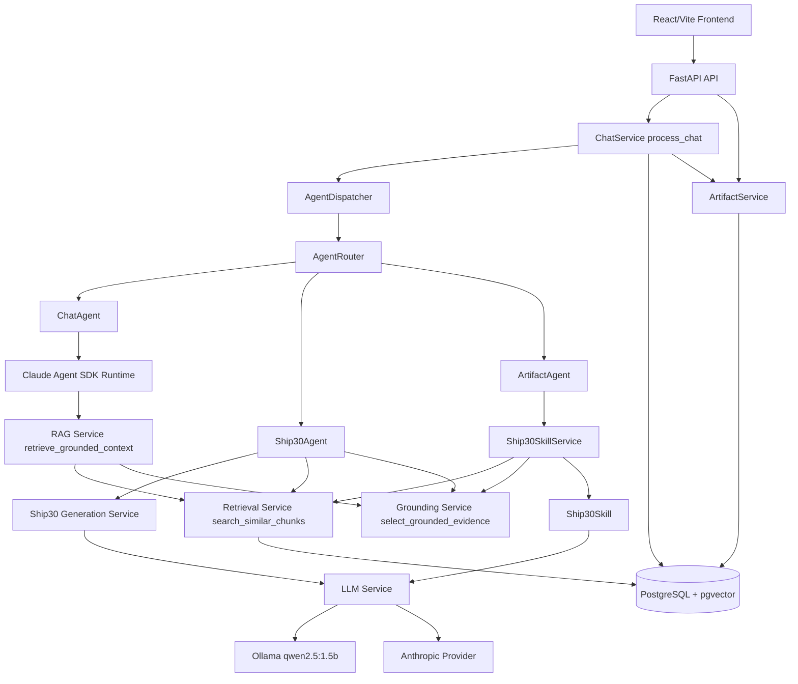

# Lenny Growth Assistant - Architecture

## 1. System Overview

Lenny Growth Assistant is a React frontend and FastAPI backend that answer product-growth questions using a local transcript knowledge base. Transcripts are ingested from `data/source-transcripts/episodes/**/transcript.md`, chunked, embedded, and stored in PostgreSQL with pgvector. Runtime requests flow through a service and agent layer, retrieve candidate chunks, select grounded evidence, generate responses, persist messages, and optionally persist generated artifacts.

## 2. Architecture Diagram



## 3. Frontend Architecture

The frontend is a React 19 and Vite application in `frontend/`. Styling uses Tailwind CSS v4 through `@tailwindcss/vite` and global CSS in `frontend/src/index.css`.

Key files:

- `frontend/src/main.jsx`: React entrypoint.
- `frontend/src/App.jsx`: owns conversations, active session, messages, artifact, loading, error, selected agent, delete confirmation, and toast state.
- `frontend/src/api/chat.js`: calls `POST /sessions/{sessionId}/chat`.
- `frontend/src/api/sessions.js`: calls session list/create/delete/message endpoints.
- `frontend/src/api/artifacts.js`: calls `GET /artifacts/{artifactId}`.
- `frontend/src/components/chat/ChatMessage.jsx`: renders messages, Markdown, and sources.
- `frontend/src/components/artifacts/ArtifactViewer.jsx`: renders sanitized artifact HTML.

## 4. Backend Architecture

The backend is a FastAPI application in `backend/app/main.py`. It registers:

- `backend/app/api/sessions.py`
- `backend/app/api/chat.py`
- `backend/app/api/artifacts.py`

The backend separates concerns into:

- API layer: request/response handling and HTTP errors.
- Services: persistence, retrieval, grounding, generation, ingestion, sanitization.
- Agents: dispatcher-facing units for chat, Ship30 planning, and artifact generation.
- Skills: `Ship30Skill` for essay writing.
- Schemas: Pydantic request/response and internal structured objects.
- Models: SQLAlchemy ORM models.
- LLM providers: Ollama and Anthropic implementations behind `LLMProvider`.

## 5. Agent Architecture

`AgentDispatcher` in `backend/app/agents/dispatcher.py` validates an agent name, resolves it through `AgentRouter`, and calls `agent.execute()`.

`AgentRouter` supports:

- `chat` -> `ChatAgent`
- `ship30` -> `Ship30Agent`
- `artifact` -> `ArtifactAgent`

`ChatAgent` calls `run_grounded_agent()` in `backend/app/claude/runtime.py`, which retrieves grounded context and runs the Claude Agent SDK with the `chat` agent definition.

`Ship30Agent` calls `generate_ship30()` and renders a validated `Ship30Plan` into Markdown.

`ArtifactAgent` calls `Ship30SkillService.generate()` and returns essay content plus flattened source metadata from the `Ship30Essay.evidence` list.

## 6. Retrieval Pipeline

The retrieval pipeline is:

query -> `generate_embedding()` -> `search_similar_chunks()` -> pgvector cosine distance query -> retrieval candidates -> `select_grounded_evidence()` -> selected `Evidence` -> LLM context.

`search_similar_chunks()` queries `transcript_chunks` joined to `sources`, orders by `tc.embedding <=> CAST(:embedding AS vector)`, and returns transcript metadata plus distance. `select_grounded_evidence()` filters candidates with lexical relevance, topic relevance, semantic score, and configured thresholds.

## 7. Evidence Architecture

`backend/app/schemas/evidence.py` defines `Evidence`:

- `evidence_id`: stable internal evidence identifier.
- `source_id`: PostgreSQL `sources.id`.
- `guest`: stored from `Source.episode`.
- `title`: source title.
- `content`: transcript chunk text.
- `chunk_index`: chunk position within a source.
- `url`: source URL when available.
- `distance`: pgvector cosine distance.

`backend/app/services/evidence_service.py` builds `evidence_id` as `{source_id}-{chunk_index}` and removes duplicate evidence IDs while preserving retrieval order.

## 8. Ship30 Architecture

Structured Ship30 plans are generated by `backend/app/services/ship30_generation_service.py`. `_build_evidence_context()` exposes stable integer evidence indexes to the LLM:

```json
{
  "action": "string",
  "evidence_indexes": [0]
}
```

The LLM does not receive backend evidence IDs. `_resolve_evidence_indexes()` maps each integer back to the selected `Evidence.evidence_id`, writes `evidence_ids`, and removes `evidence_indexes`. Only then does `Ship30Plan.model_validate()` run.

This avoids asking a small local model to copy long UUID-like IDs exactly, while preserving backend validation against real selected evidence.

## 9. Ship30 Essay Architecture

The essay path is:

`Ship30SkillService` -> `search_similar_chunks()` -> `select_grounded_evidence()` -> `Ship30Skill.generate()` -> `generate_response()` -> `Ship30Essay` -> `ArtifactAgent` -> `ChatService` -> persisted artifact.

`Ship30Skill` builds a prompt from selected transcript evidence, truncating each evidence content field to `item.content[:3500]`, and asks for an approximately 700-word Ship30-style essay. The returned `Ship30Essay` contains both `content` and the full supporting `Evidence` objects.

## 10. Source Preservation

Source metadata is preserved by carrying `Evidence` objects until the artifact agent boundary. `ArtifactAgent` maps `essay.evidence` into dictionaries with `evidence_id`, `source_id`, `guest`, `title`, and `url`. `ChatService` persists this list in `Message.sources` JSONB when saving the assistant response. `frontend/src/components/chat/ChatMessage.jsx` renders those sources as links.

One current schema limitation: `backend/app/schemas/chat.py` defines `ChatSource` without `source_id`, so FastAPI may omit `source_id` from the immediate chat response even though `ChatService` persists it in `messages.sources`.

## 11. Database Architecture

`backend/app/models.py` defines:

- `User`: `id`, `name`, `email`, `created_at`; owns sessions.
- `Session`: `id`, `user_id`, `title`, timestamps; owns messages and artifacts.
- `Message`: `id`, `session_id`, `role`, `content`, `sources` JSONB, `created_at`.
- `Source`: transcript source metadata, including title, episode/guest, URL, publish date.
- `TranscriptChunk`: source chunk content, `chunk_index`, 384-dimensional pgvector embedding, JSONB metadata.
- `Artifact`: generated content with `session_id`, optional `message_id`, type, title, content, timestamp.

Alembic migrations live under `backend/migrations/versions/`.

## 12. LLM Architecture

`backend/app/llm/base.py` defines `LLMProvider`. `backend/app/llm/factory.py` selects a provider from `settings.llm_provider`.

Supported provider values:

- `ollama`: `OllamaProvider`, calls `{OLLAMA_BASE_URL}/api/generate` with `OLLAMA_MODEL`, low temperature, and a 300-second read timeout.
- `anthropic`: `AnthropicProvider`, calls Anthropic Messages API with `ANTHROPIC_API_KEY` and `ANTHROPIC_MODEL`.

Chat agent execution specifically uses `claude-agent-sdk` through `backend/app/claude/runtime.py`. Ship30 plan and essay generation use `generate_response()` and the provider factory.

There is no automatic fallback between providers. Misconfiguration raises an error.

## 13. Error Handling

The code defines service/agent-specific exception classes including `ChatServiceError`, `ArtifactServiceError`, `Ship30ServiceError`, `Ship30SkillServiceError`, `Ship30SkillError`, `AgentDispatcherError`, `AgentRouterError`, and `ClaudeRuntimeError`.

API routes convert known service errors into HTTP 404 or 500 responses. Generation code rejects empty prompts, empty model responses, invalid JSON, markdown-wrapped JSON for Ship30 plans, invalid evidence indexes, unsupported numerical claims, and weakly grounded actions.

## 14. Persistence

Sessions and messages are persisted through `backend/app/services/session_service.py`. `process_chat()` saves the user message first, dispatches the agent, saves the assistant message with sources, and creates an artifact only when `agent == "artifact"`.

Artifacts are persisted through `backend/app/services/artifact_service.py`, which sanitizes content with `sanitize_html()` before writing to PostgreSQL.

## 15. Security

Actual implemented practices:

- Secrets are read from environment variables through Pydantic settings.
- `.env.example` uses placeholders and contains no real secrets.
- Chat request fields have Pydantic length validation.
- Artifact HTML is sanitized with `nh3` before persistence.
- Sanitized artifact HTML allows only specific tags and URL schemes.
- Frontend source links use `target="_blank"` with `rel="noopener noreferrer"`.

Not implemented:

- Authentication.
- Authorization.
- CSRF protection.
- Rate limiting.
- Request logging/redaction policy.

## 16. Deployment

No Dockerfile, docker-compose file, GitHub Actions workflow, or production deployment configuration is present in the repository. The implemented setup is local development against a configured PostgreSQL database and local or cloud LLM provider.

## 17. Known Limitations

- Local `qwen2.5:1.5b` has limited reasoning and long-form generation quality.
- Long essay generation can be slow with Ollama.
- Transcript context is truncated for local model performance.
- Retrieval quality depends on chunking and embedding similarity.
- Strict grounding can produce sparse plans when evidence is narrow.
- Anthropic support requires explicit API key/model configuration.
- The frontend uses a fixed demo user ID.
- Copy/export artifact buttons are not wired.
- The backend `ship30` planning agent is not exposed in the current frontend dropdown.
- `ArtifactHeader.jsx` expects `artifact.createdAt`, while `ArtifactResponse` returns `created_at`.
